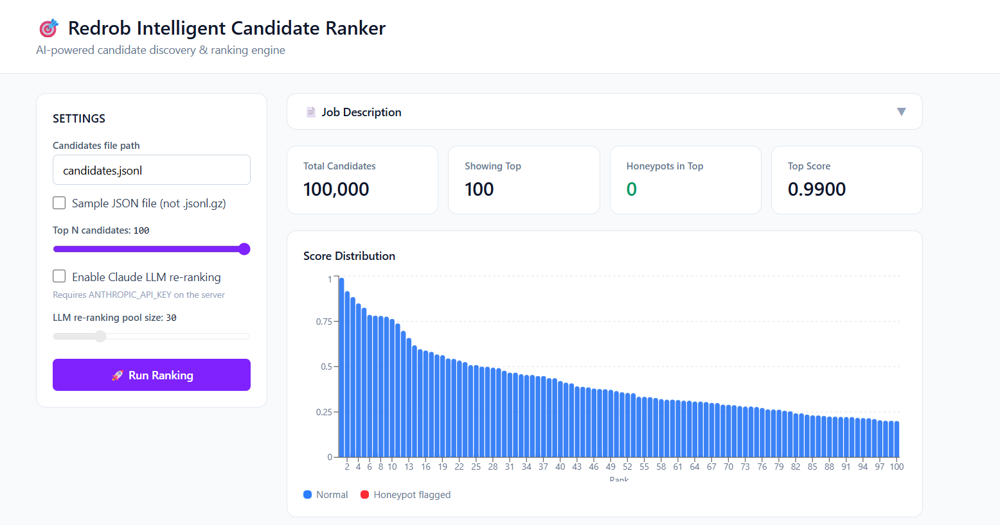
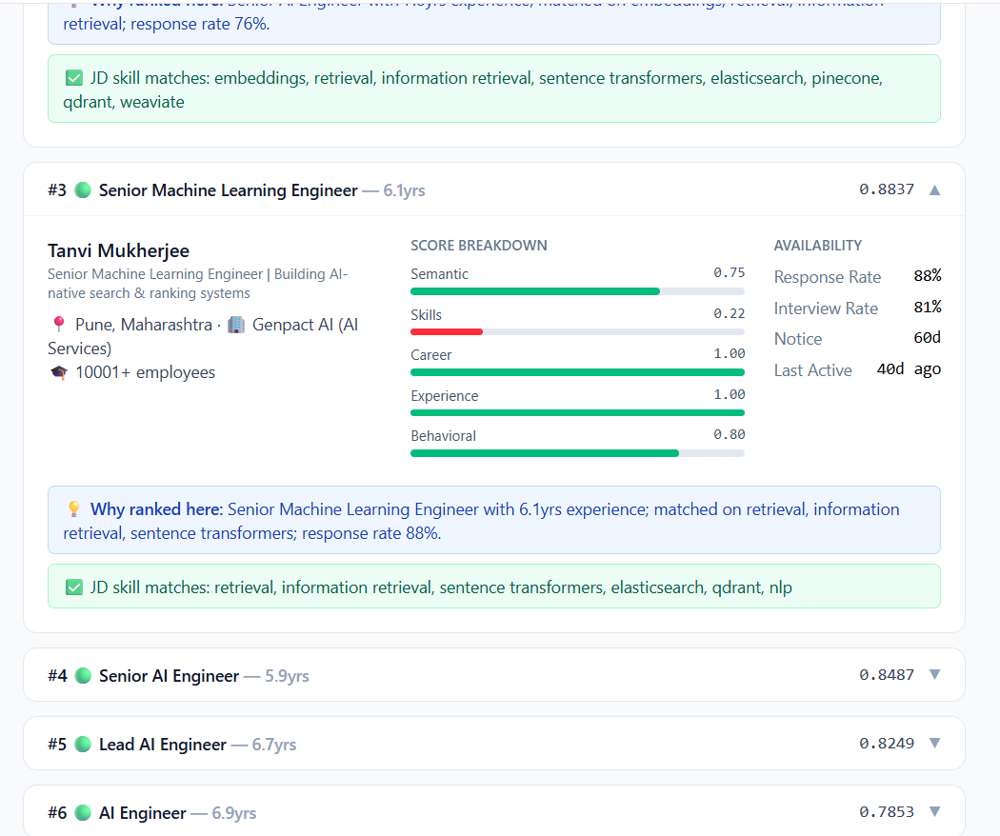

# 🚀 TalentLens AI
### Intelligent AI Candidate Ranking Platform

TalentLens AI is an intelligent candidate ranking platform that ranks **100,000+ candidate profiles** for a given job description using semantic search, structured feature scoring, behavioral analysis, honeypot detection, and optional Claude AI re-ranking. Instead of relying on simple keyword matching, TalentLens AI evaluates a candidate's actual career trajectory, technical skills, work experience, and behavioral signals to identify the best fit for a role.

---

## 📸 Application Preview

### Dashboard



### Ranking Results



---

## ✨ Features

- 🔍 Semantic candidate retrieval using Sentence Transformers
- 📊 Structured scoring based on skills, experience, and career history
- 🧠 Behavioral scoring using recruiter-inspired heuristics
- 🚨 Honeypot candidate detection to filter suspicious profiles
- 🤖 Optional Claude AI re-ranking for improved ranking quality
- ⚡ Embedding caching for ultra-fast repeated inference
- 🌐 Modern React + FastAPI web application
- 📈 Interactive ranking visualizations and analytics
- 📄 CSV export of ranked candidates

---

## 🏗️ Architecture

```text
                    React Frontend
                          │
                          ▼
                   FastAPI Backend
                          │
                          ▼
                 Candidate Ranking Pipeline
                          │
      ┌───────────────────┼───────────────────┐
      ▼                   ▼                   ▼
 Semantic Search    Structured Score    Behavioral Score
      │                   │                   │
      └──────────────┬────┴───────────────────┘
                     ▼
             Honeypot Detection
                     ▼
        Claude AI Re-ranking (Optional)
                     ▼
            Final Candidate Ranking
```

---

## 🛠️ Tech Stack

### Frontend
- React
- TypeScript
- Vite
- CSS

### Backend
- Python
- FastAPI
- Uvicorn

### AI / Machine Learning
- Sentence Transformers
- all-MiniLM-L6-v2
- NumPy
- Anthropic Claude API (Optional)

---

## 📂 Repository Structure

```text
redrob-ai-ranker/
│
├── assets/                 # README screenshots
├── frontend/               # React frontend
├── pipeline/               # AI ranking pipeline
│   ├── behavioral.py
│   ├── encoder.py
│   ├── feature_scorer.py
│   ├── honeypot.py
│   ├── jd_parser.py
│   ├── llm_reranker.py
│   └── loader.py
│
├── server.py               # FastAPI backend
├── rank.py                 # CLI ranking pipeline
├── app.py                  # Streamlit prototype
├── requirements.txt
└── README.md
```

---

## ⚙️ Installation

Clone the repository:

```bash
git clone https://github.com/Udhey-Goyal/redrob-ai-ranker.git
cd redrob-ai-ranker
```

Create a virtual environment:

```bash
python -m venv venv
```

Activate it:

**Windows**

```bash
venv\Scripts\activate
```

**Linux / macOS**

```bash
source venv/bin/activate
```

Install dependencies:

```bash
pip install -r requirements.txt
```

---

## ▶️ Running the Backend

```bash
uvicorn server:app --reload --port 8000
```

Backend API:

```
http://127.0.0.1:8000
```

---

## ▶️ Running the Frontend

```bash
cd frontend

npm install

npm run dev
```

Frontend:

```
http://localhost:5173
```

---

## 🖥️ Running the CLI Pipeline

```bash
python rank.py --candidates candidates.jsonl --out submission.csv --no-llm
```

---

## 🤖 Claude AI Support

Claude AI re-ranking is optional.

Configure your Anthropic API key:

```bash
ANTHROPIC_API_KEY=YOUR_API_KEY
```

Run without Claude:

```bash
python rank.py --no-llm
```

---

## 📊 Performance

| Metric | Value |
|---------|-------|
| Dataset Size | 100,000 Candidates |
| Embedding Model | all-MiniLM-L6-v2 |
| Ranking Time (Cached) | ~7 Seconds |
| Backend | FastAPI |
| Frontend | React |
| LLM | Claude AI (Optional) |

---

## 📁 Dataset

The original **100,000 candidate dataset** is not included in this repository because it exceeds GitHub's file size limit.

For demonstration purposes, the project includes:

```text
sample_candidates.json
```

---

## 🚀 Roadmap

- Resume PDF Upload
- Explainable AI reasoning
- Multi-job ranking
- Candidate comparison dashboard
- Recruiter analytics
- Authentication & database integration

---

## 👨‍💻 Author

**Udhey Goyal**

- GitHub: https://github.com/Udhey-Goyal

---

## 📄 License

This project was developed for the **Redrob AI Hiring Challenge** and is shared for educational and portfolio purposes.

---

⭐ If you found this project interesting, consider giving it a star!
